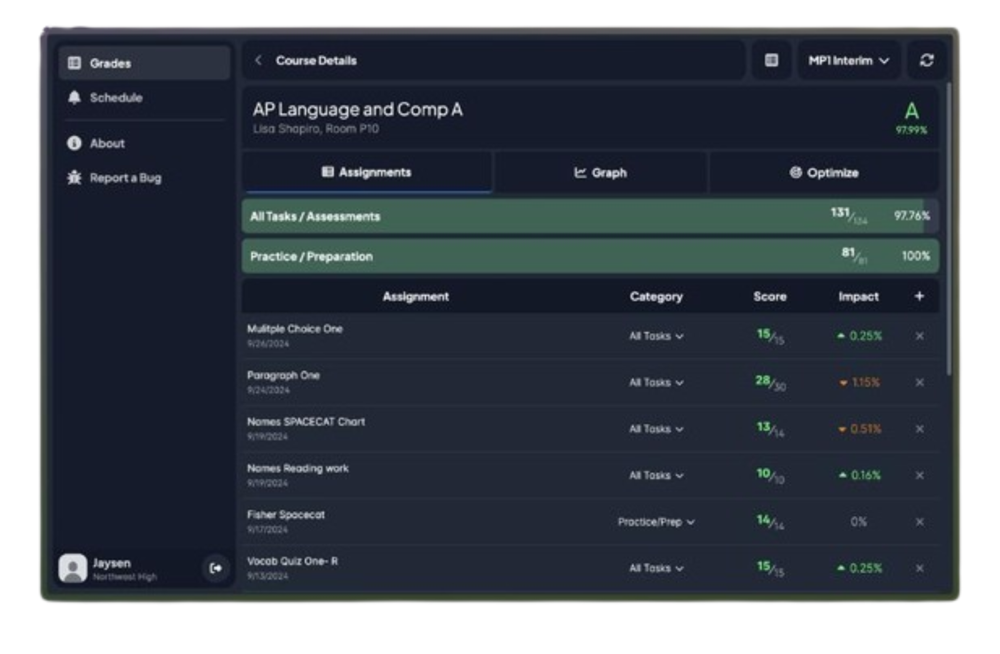
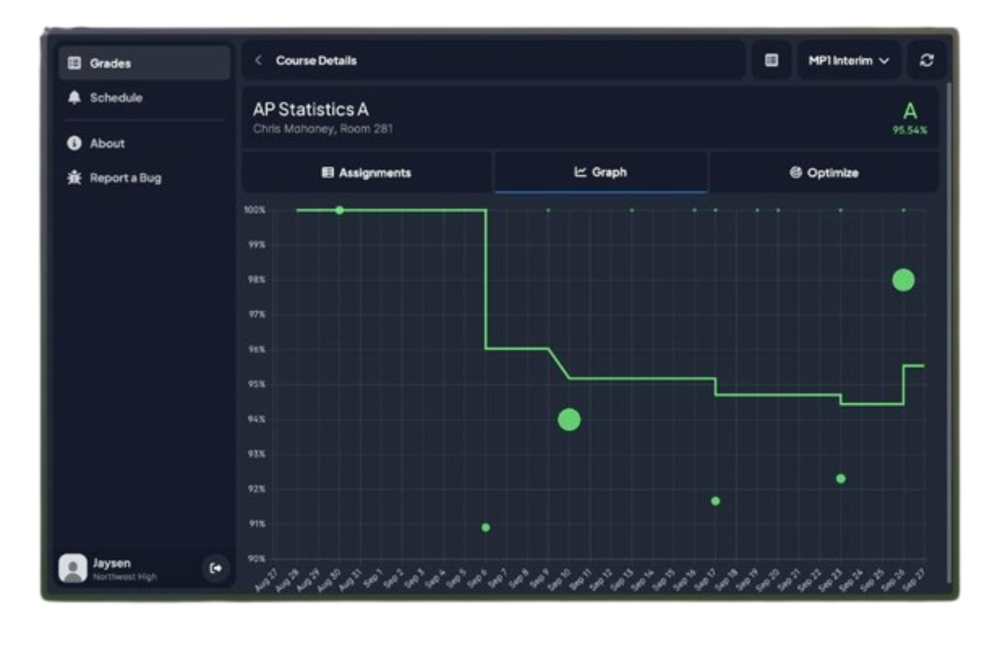

<h1 align="center" id="turbovue">
  
   
  TurboVUE
</h1>

  
    A fast, clean, and lightweight third-party alternative client to StudentVUE.    
     
    <a href="https://grades.jay3332.tech"><b>Go to TurboVUE</b></a>
  

  <table>
    <tr>
      <td>
        
      </td>
      <td>
        
      </td>
    </tr>
  </table>

## Why a StudentVUE client?

The StudentVUE user experience is described by many as slow, clunky, and outdated.
TurboVUE aims to improve on the UI/UX of viewing your grades and assignments through a
clean, fast, and lightweight client.

## How it works with the "new" StudentVUE

TurboVUE was created after all other third-party StudentVUE clients stopped working
after major changes to the StudentVUE backend. This new backend is more 
restrictive: most data must be physically scraped via a proxy server to circumvent CORS,
and pages are dynamically loaded rather than being able to be fetched directly. As such,
TurboVUE makes use of a 
[simple proxy server](https://github.com/jay3332/turbo-vue/blob/main/proxy/main.py)
to fetch and serialize data from the StudentVUE backend.

## Features

- Fast, accessible, responsive, and modern design
- Much more streamlined view of grades and assignments
- "What If" grade calculator
  - Modify scores on any assignment, delete assignments, and add custom assignments
    to see how they would affect your grade
- Graphs and grade analysis
  - View how your grade has changed over time with a graph
- Color-coded scores and assignment types
- Themes
- *more to come*

### Coverage

- [x] Login
- [x] Gradebook
  - [x] Switch Grading Periods (MP2, MP2 Interim, etc.)
  - [x] Assignments
  - [x] Graph/Grade Analysis
  - [ ] Grade Optimizer
- [x] Schedule
  - [ ] Live Countdown
- [ ] Attendance
- [ ] Documents

_This project is not affiliated with Edupoint._